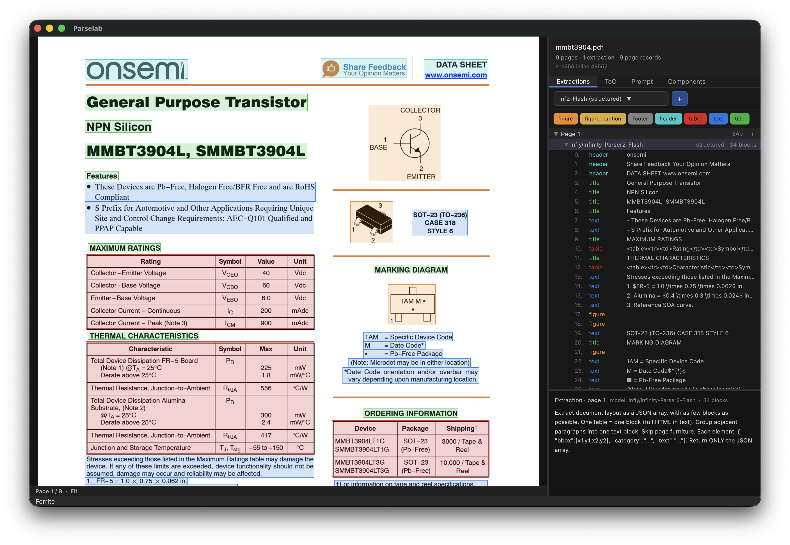
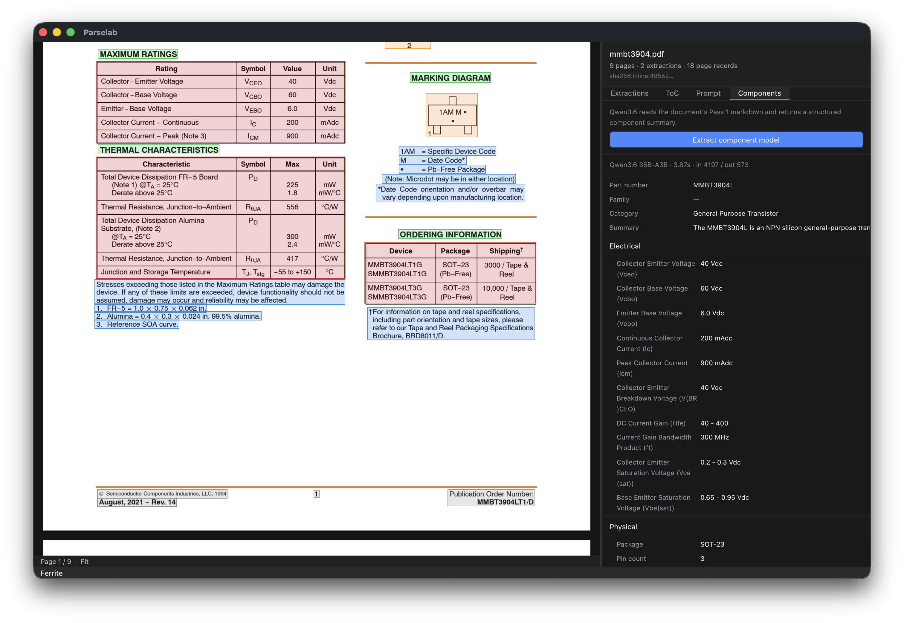

# Parselab

Tools for comparing vision-language models on PDF data extraction.
Modal-deployed VLM workers, a small datasheet corpus, a benchmark
harness, and a desktop app for browsing model output next to source
PDFs.



Parselab was created as part of an EDA tool that uses VLMs to turn vendor
datasheets into a queryable component library
([See AI Tinkerers presentation, May 6th 2026](https://raleigh.aitinkerers.org/talks/rsvp_PDqUleDH6rI)).
The EDA tool is one consumer; the harness, workers, and IR types are
reusable for any project that needs to compare VLMs on PDFs.

## What's here

- **Modal workers** for the VLMs we test against:
  granite-docling-258M, GLM-OCR, Infinity-Parser2-Flash (2B),
  Infinity-Parser2-Pro (35B-MoE), Qwen3.5-9B, Qwen3.6-35B-A3B, and
  docling.
- **A 12-PDF datasheet corpus** in `data/corpus/` (passives,
  discretes, MCUs, USB-PD, connectors).
- **A benchmark harness** that runs inside a Modal container
- **A desktop app** (Rust + Zed's GPUI framework) that opens a PDF, asks Modal which
  workers are deployed, and dispatches extractions against the model
  you pick. Results render page-by-page next to the source.
- **Numbers and methodology** in [`BENCHMARKS.md`](BENCHMARKS.md):
  cost, throughput, and fidelity across the model axis, plus a
  one-pass-vs-two-pass strategy writeup.

## Run a benchmark

You need a Modal account, the CLI authenticated, and Python 3.12+
with [uv](https://docs.astral.sh/uv/).

```sh
cd modal
uv sync
modal deploy glm_ocr/app.py        # and any other workers you want
uv run modal run harness/remote.py --preset glm-ocr --max-tokens 1024
uv run modal run harness/remote.py --preset inf2-flash --max-tokens 4096
```

`--save-content` writes per-page chat-completion content to
`target/quality/<preset>-<utc>/` for offline comparison. See
[`modal/README.md`](modal/README.md) for per-worker details, GPU
choices, and tuning notes.

## Run granite locally (Apple Silicon)

```sh
cd scripts
uv sync
uv run python run_granite_docling_mlx.py --pages 4
```

No Modal account needed. About 7s per page on M1 Pro.

## Build the desktop app

macOS needs Apple's Metal Toolchain:

```sh
xcodebuild -downloadComponent MetalToolchain
./vendor/setup-pdfium.sh           # one-time: fetch the pdfium binary
cargo build --release -p parselab
target/release/parselab <path-to-pdf>
```

The app opens a PDF, queries Modal to see which `parselab-*` workers
are deployed, and offers a dropdown to run an extraction against any
of them (GLM-OCR for markdown, or Inf2-Flash for structured output
with bboxes). Each run appends a new extraction to the document so
you can compare models side-by-side. The Components tab runs
Qwen3.6 over the extracted markdown and emits a structured part
summary:



GPUI is pulled directly from the upstream Zed monorepo as a cargo
git dependency. First build is slow; subsequent builds are fast.

## Layout

```
parselab/
├── README.md
├── BENCHMARKS.md          # benchmark numbers + methodology
├── LICENSE                # MIT
├── Cargo.toml             # Rust workspace
├── modal/                 # Modal worker definitions + harness
├── scripts/               # Apple Silicon dev tools (MLX, TableFormer)
├── crates/
│   ├── ir/                # per-page extraction IR + KDL on-disk format
│   ├── component-model/   # facet model over IR
│   ├── extractor-client/  # Rust client for the Modal workers
│   ├── pdf-pane/          # GPUI pane: PDF renderer + region selection
│   ├── inspector-pane/    # GPUI pane: per-page extraction inspector
│   └── parselab/          # desktop binary
└── data/
    ├── corpus/            # 12-datasheet electronics corpus
    └── tests/quality/     # committed fidelity artifacts
```

## License

MIT — see [`LICENSE`](LICENSE).

The corpus PDFs are vendor datasheets reproduced from their public
source pages. The models have their own (mostly Apache 2.0)
licenses — see each worker's `app.py` for model-card links.
